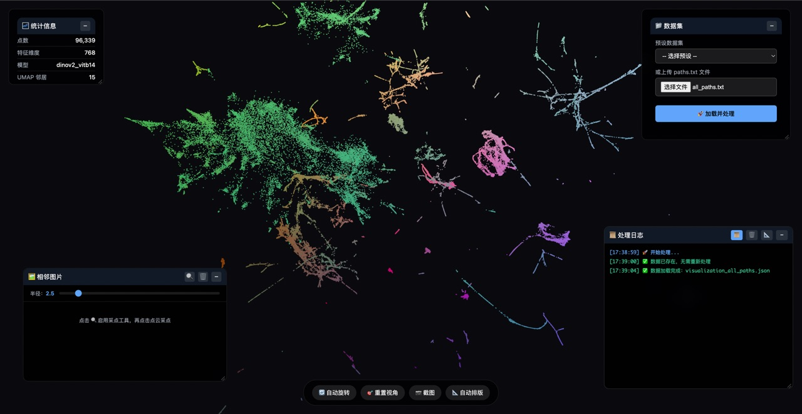
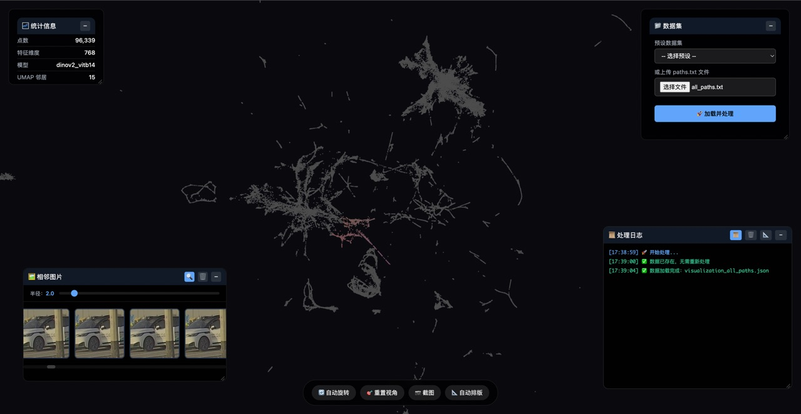
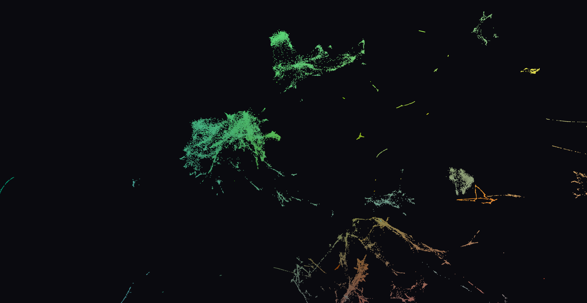

# DINOv3 UMAP 3D 可视化

使用 DINOv3 提取图片特征，UMAP 降维到 3D，Three.js 前端交互式可视化。

## 特性

- **可拖动窗口布局** - 统计信息、数据集选择、日志面板可自由拖动，支持边缘吸附和一键自动排版
- **服务器文件浏览** - 直接选择部署机器上的文件，无需从本地上传
- **文件上传** - 也支持从本地上传 paths.txt 文件
- **多标签支持** - 输入 txt 可带多标签（`/path/to/img.jpg label1 label2`），标签会贯穿 pipeline 输出到 JSON
- **采点交互** - 点击点云中的点，查看邻域内图片缩略图；半径范围 0-1（1 = 所选点到最远点距离），支持双击数值直接编辑
- **可扩展筛选系统** - 基于 BaseFilter + 注册机模式，内置类别筛选；筛选后非目标点不可交互，距离计算仅在筛选结果内进行
- **右键图片预览** - 右键点击点弹出可拖动预览窗口，支持全屏查看；窗口记忆上次位置
- **悬浮操作球（FAB）** - 底部工具栏按钮折叠为可拖动悬浮球，自动吸附屏幕边缘，闲置后收起为半球；面板最小化后收纳至 FAB
- **设置面板** - 可调节点大小、透明度、自动旋转速度、相机动画平滑度、鼠标悬浮放大倍数
- **智能高亮** - 鼠标悬浮实时高亮（放大显示），右键预览点独立钉住高亮，两者互不干扰
- **相机平滑过渡** - 选点后相机通过 1€ 低通滤波器平滑飞向目标，动画参数可在设置中调节
- **实时日志** - 处理过程中实时显示日志，支持清空和自动滚动
- **位置保存** - 面板位置自动保存到浏览器，刷新后保持布局
- **数据格式转换** - 提供 BaseConverter 基类和 FolderConverter，可将不同数据源转换为标准 txt 格式

## 快速开始

### 1. 安装依赖

```bash
pip install -r requirements.txt
```

### 2. 运行

**Web 界面方式（推荐）：**
```bash
python src/server/api.py
```
访问 http://localhost:8000/view ，在界面中浏览服务器文件或上传 txt，点击"加载并处理"。

**命令行方式：**
```bash
python src/main.py /path/to/image_paths.txt --model dinov2_vitb14
```

## 输入格式

txt 文件，每行一个图片路径，可选带空格分隔的标签：

```
# 纯路径
/path/to/img_001.jpg
/path/to/img_002.jpg

# 路径 + 标签（单个或多个）
/path/to/img_001.jpg cat
/path/to/img_002.jpg dog outdoor
```

### 使用 FolderConverter 生成带标签的 txt

如果图片按文件夹分类，可以用 `FolderConverter` 自动生成：

```bash
python script/folder_converter.py /path/to/image_folders -o output.txt
```

目录结构示例：
```
image_folders/
├── cat/
│   ├── 001.jpg
│   └── 002.jpg
└── dog/
    └── 003.jpg
```
输出 txt：
```
/abs/path/cat/001.jpg cat
/abs/path/cat/002.jpg cat
/abs/path/dog/003.jpg dog
```

## 输出

- `output/visualization_*.json` - 包含 3D 坐标、颜色、元数据，有标签时包含 `labels` 字段
- Web 界面展示交互式 3D 点云
- 实时处理日志

## 项目结构

```
ManifoldFirmament/
├── src/
│   ├── main.py                # CLI 入口
│   ├── models.py              # 数据契约（含 labels 支持）
│   ├── data/
│   │   └── loader.py          # 图片路径 + 标签加载
│   ├── features/
│   │   └── extractor.py       # DINOv3 特征提取
│   ├── dimensionality/
│   │   └── reducer.py         # UMAP 降维
│   ├── export/
│   │   └── pipeline.py        # JSON 数据导出
│   ├── filters/
│   │   ├── base.py            # 过滤器基类（BaseFilter）
│   │   ├── registry.py        # 过滤器注册机（FilterRegistry）
│   │   └── category_filter.py # 类别筛选实现
│   ├── server/
│   │   └── api.py             # FastAPI 服务（文件浏览 + 后台处理 + 筛选 API）
│   └── frontend/
│       ├── index.html         # 可视化页面
│       └── viewer.js          # Three.js 渲染 + 交互
├── script/
│   ├── base_converter.py      # 数据格式转换基类
│   └── folder_converter.py    # 按文件夹名打标签
├── output/                    # 生成的可视化数据（已 gitignore）
├── doc/
├── assets/
├── .gitignore
├── requirements.txt
└── README.md
```

## 可视化操作

- **拖动面板** - 抓住面板标题栏拖动，靠近边缘自动吸附
- **自动排版** - 点击悬浮球中"自动排版"按钮一键整理布局
- **最小化** - 点击面板右上角 − 按钮，面板收纳至悬浮球；在悬浮球中点击对应标签恢复
- **悬浮球** - 可拖动，自动吸附屏幕边缘，闲置自动收起为半球；点击展开操作按钮
- **缩放旋转** - 鼠标滚轮缩放，左键拖动旋转，右键平移
- **采点查看** - 点击 🔍 启用采点工具，左键点击点云中的点查看邻域图片；可连续选点切换中心
- **右键预览** - 右键点击任意数据点弹出图片预览窗口，支持拖动和全屏；窗口记忆上次位置
- **鼠标高亮** - 鼠标悬浮在点上时自动放大高亮显示；右键预览的点独立保持高亮直到关闭窗口
- **数据筛选** - 在筛选卡片中选择过滤器和参数，筛选后仅目标点可交互
- **设置** - 点击悬浮球中 ⚙️ 打开设置面板，调节点大小、透明度、旋转速度、动画平滑度、悬浮放大倍数
- **半径调节** - 选点后拖动滑条调节邻域半径（0-1），双击半径数值可直接输入精确值

## 注意事项

- **数据文件不提交** - `output/`、`*.txt` 测试数据、`__pycache__/` 已加入 `.gitignore`
- **后台处理** - 大文件处理在后台线程运行，不会阻塞 UI
- **日志限制** - 最多保留 1000 条日志

## 效果展示





